<!-----
NEW: Check the "Suppress top comment" option to remove this info from the output.

Conversion time: 7.206 seconds.


Using this Markdown file:

1. Paste this output into your source file.
2. See the notes and action items below regarding this conversion run.
3. Check the rendered output (headings, lists, code blocks, tables) for proper
   formatting and use a linkchecker before you publish this page.

Conversion notes:

* Docs to Markdown version 1.0β31
* Mon Dec 13 2021 11:24:09 GMT-0800 (PST)
* Source doc: Readme1
* Tables are currently converted to HTML tables.
* This document has images: check for >>>>>  gd2md-html alert:  inline image link in generated source and store images to your server. NOTE: Images in exported zip file from Google Docs may not appear in  the same order as they do in your doc. Please check the images!

----->


1. El Proyecto
    * Descripción del problema
    * Necesidad de Big Data
    * Solución
2. Modelo de datos
3. Descripción técnica
    * Información sobre el dataset
    * Cómo ejecutar el programa
4. Rendimiento
5. Conclusión


### 1. El proyecto


#### 1.1 Descripción del problema

El objetivo es poder identificar las causas de los accidentes producidos en Estados Unidos para poder emprender medidas para reducirlos. Estudiaremos una gran cantidad de accidentes (1.516.064 accidentes) junto con el estado de muchas de las causas más frecuentes que los causan, como el día de la semana en el que se produjeron o la situación meteorológica.


#### 1.2 Necesidad de Big Data

Debido a la cantidad de accidentes, a todos los datos que trae cada uno (47 columnas) y a las costosas operaciones necesarias para extraer los datos(como ordenar todos los accidentes por un dato en concreto) es casi obligatorio utilizar las tecnologías  del Big Data para llegar a unos resultados razonables.


#### 1.3 Solución

Para poder hemos identificado una modelo de actuación sobre el dataset: 

Separando en scripts distintos por cada dato que queríamos obtener, hemos aislado las columnas necesarias para el análisis y mediante funciones proporcionadas por pyspark hemos procesado los datos haciendo tanto recuento de los accidentes como la media de la gravedad de estos.

Una vez obtenidos los datos, guardando la salida en un archivo xlsx hemos sido capaces de crear gráficos para ver los resultados de forma visual poder analizarlos y sacar una conclusión.

Ejemplo de tabla:


### 2. Modelo de datos 

               


Los datos han sido obtenidos de la web “kaggle”, concretamente de esta entrada:

[https://www.kaggle.com/sobhanmoosavi/us-accidents](https://www.kaggle.com/sobhanmoosavi/us-accidents)

Al descargar este csv se pueden observar miles de accidentes así como datos sobre ellos.

Las datos más relevantes para nuestro análisis han sido:


* Fecha de inicio del accidente. Tanto para saber el mes y el año como para saber el día de la semana en la que se produjo y la franja horaria.
* Estado (de Estados Unidos) en el que se produjo.
* Gravedad del accidente. Del 1 al 4. En la tabla se llama CSV.
* Estado meteorológico. 

	


### 3. Descripción técnica	


#### Información del dataset

Software usado:


* 1 archivo .csv con el dataset.
* 1 archivo de excel por cada conjunto de datos obtenido (6 en total).
* 6 scripts en python para el procesamiento del .csv inicial y encargados de generar los excel para poder crear las gráficas.
* 14 imágenes en png necesarias para facilitar el análisis de los datos. 

La mayoría del software ha sido creado en ubuntu y su ejecución la hemos realizado mediante el terminal de Ubuntu Bash con el soporte de Pyspark. Para que funcione correctamente el dataset inicial (US_Accidents_Dec20_updated.csv) debería localizarse en el mismo directorio . Para ejecutar el script hay que escribir "spark-submit (nombre del script)". Tras la ejecución se genera tanto el output por consola como un excel que se puede abrir y de dónde hemos sacado las gráficas.

 

Los 6 archivos que hemos creado sirven para obtener tanto el número de accidentes como la media de severidad según:


* Mes y año (desde 2016 hasta 2020).
* Estado.
* Día de la semana.
* Franja horaria.
* Clima
* Visibilidad


#### Cómo ejecutar el programa

	

Para ejecutar en **local** primero hay que tener instalado python.


```
$ sudo apt-get install python
```


Y ahora instalar pyspark. 


```
$ curl -O https://ftp.cixug.es/apache/spark/spark-3.1.2/spark-3.1.2-bin-hadoop3.2.tgz
$ tar xvf spark-3.1.2-bin-hadoop3.2.tgz
$ sudo mv spark-3.1.2-bin-hadoop3.2 /usr/local/spark
```


Y cada vez que se inicie una sesión para probar el software hay que actualizar la variable PATH mediante el siguiente comando:


```
$ source ~/.profile
```


Con los anteriores requisitos cumplidos, habiendo actualizado PATH sobre el directorio del proyecto, ya se pueden ejecutar los datos. Para ello hay que ejecutar el siguiente comando sustituyendo &lt;script> por el nombre del script


```
$ spark-submit <script>
```


Por ejemplo: $ spark-submit T1_Months.py

Obteniendo de cada script un mensaje por consola en el que se puede observar la tabla con el resultado, y un archivo .xlsx (excel).

Para ejecutar en el **cloud** hemos contemplado distintos procedimientos, por un lado teníamos pensado un entorno de App Engine flexible, al que le pasaríamos los scripts y un link con la base de datos, y se encargaría de suministrar máquinas a demanda, pero había un inconveniente, necesitaríamos instalar pyspark en estas máquinas y eso es demasiado complicado. La otra opción que habíamos pensado era crear un cluster de DataProc y enviarle trabajos de pyspark a ese cluster. Aquí surgen dos opciones, la primera, descargar la base de datos en el Master Node y ejecutar el script sin ninguna modificación, la segunda, subir la base de datos a un Bucket en gcp y modificar el script. Debido a las políticas de costes de GCP sale más barato almacenar la base de datos en un Bucket y como tenemos que hacer muchas pruebas y crear muchos clusters no queremos salirnos de presupuesto.

La modificación que he hecho en los scripts es importar una librería para comunicar con GCP y luego el path del bucket en la variable global PATH que existe en cada script, de esta manera cuando pyspark descentraliza la computación todos los nodos pueden acceder a la base de datos. 

En total hemos creado 11 cluster con las siguientes características.

Cluster 1: 1 Master, 2 Workers de propósito general.

Cluster 2: 1 Master, 5 Workers de propósito general.

Cluster 3: 1 Master, 2 Workers especializados en computar con 4 Threads. 

Cluster 4: 1 Master, 5 Workers especializados en computar con 4 Threads. 

Cluster 5: 1 Master, 3 Workers especializados en computar con 4 Threads.

Cluster 6: 1 Master, 2 Workers especializados en computar con 8 Threads.

Cluster 7: 1 Master, 5 Workers especializados en computar con 8 Threads.

Cluster 8: 1 Master, 3 Workers especializados en computar con 8 Threads. 

Cluster 9: 1 Master, 2 Workers especializados en computar con 16 Threads. 

Cluster 10: 1 Master, 3 Workers especializados en computar con 16 Threads.

Cluster 11: 1 Master, 5 Workers especializados en computar con 16 Threads.  


### 4. Rendimiento


### Para realizar la comparativa de rendimiento hemos usado el mismo script en la misma zona y región para todos los tipos de máquinas en una franja de tiempo compacta con la intención de mantener constantes las variables externas y ajenas a nosotros que no podemos controlar.


### El rendimiento de los clusters lo podemos entender de distintas maneras: 

Rendimiento de cada cluster de manera individual, es decir, cual es el porcentaje máximo de  de rendimiento que ha alcanzado el cluster a nivel de CPU en los trabajos que se han enviado.

Hemos recopilado los siguientes datos.

Cluster 1


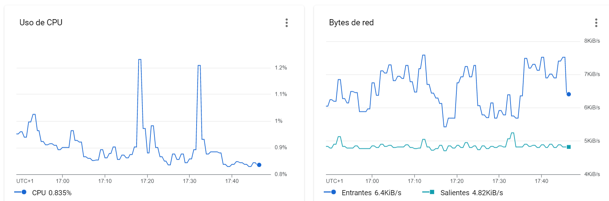


Cluster 2


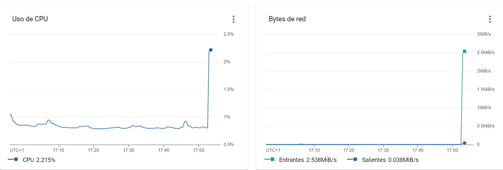


Cluster 3


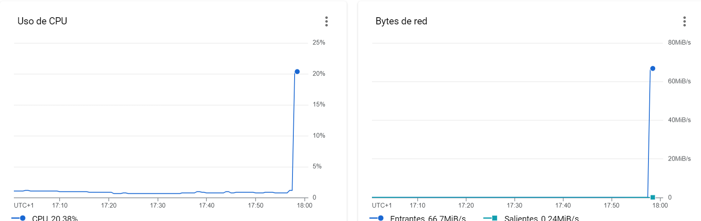


Cluster 4


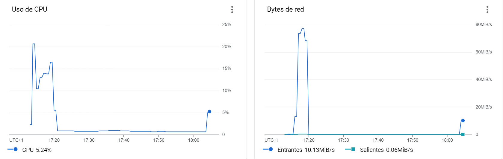


Cluster 5


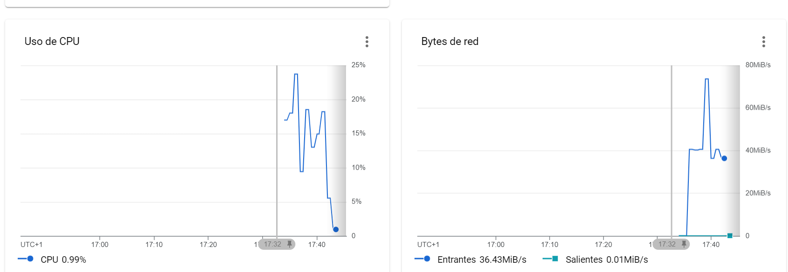


Cluster 6


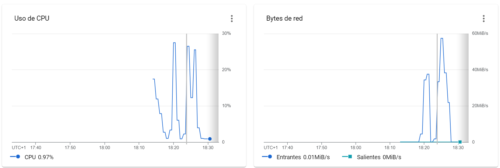


Cluster 7


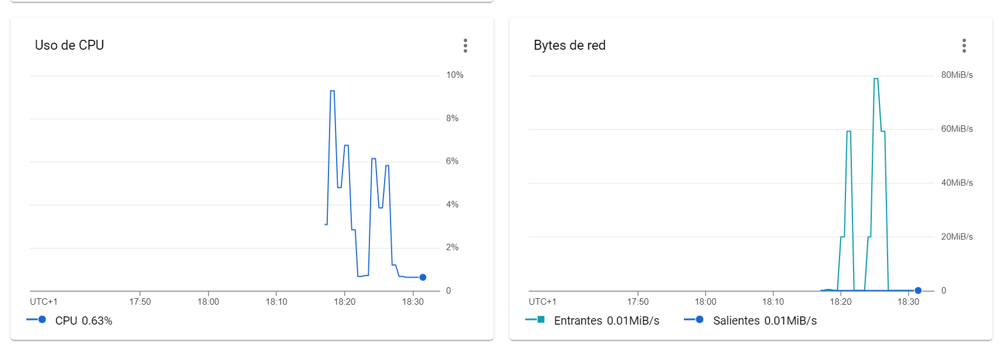


Cluster 8


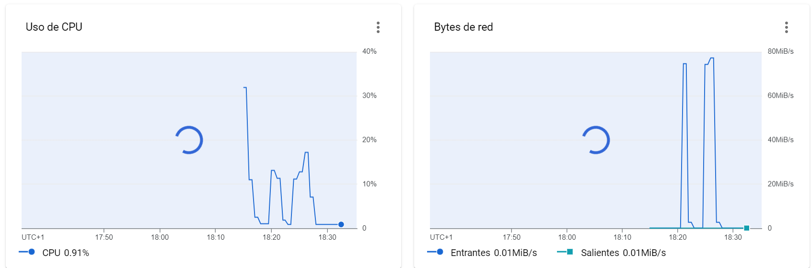


Cluster 9


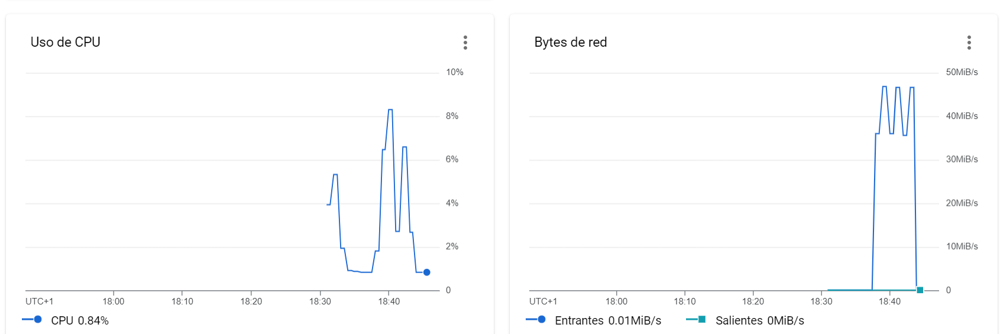


Cluster 10


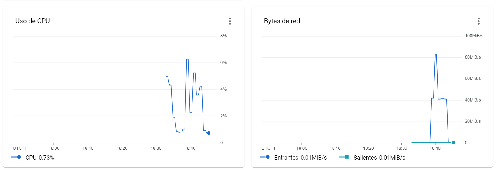


Cluster 11


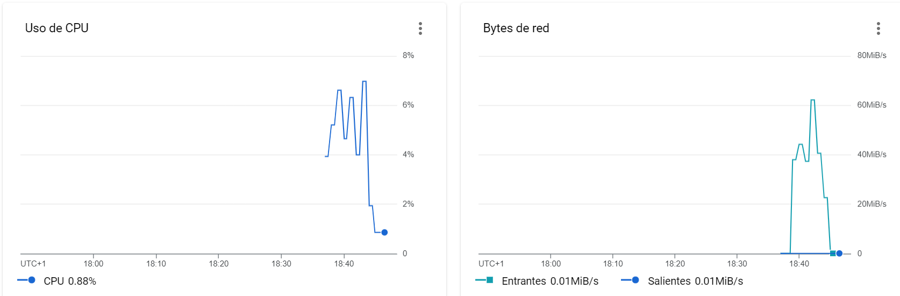


Los resultados obtenidos en tiempo de ejecución son:

---------------------------cluster 1-------------------------------------

master		: 1	: general purpose

workers	: 2	: general purpose

tiempo		: 51 s

---------------------------cluster 2------------------------------------

master		: 1	: general purpose

workers	: 5	: general purpose

tiempo		: 61 s

---------------------------cluster 3-------------------------------------

master		: 1	: compute expert-4t

workers	: 2 	: compute expert-4t

tiempo		: 40 s

---------------------------cluster 4-------------------------------------

master		: 1	: compute expert-4t

workers	: 5	: compute expert-4t

tiempo		: 43 s

---------------------------cluster 5-------------------------------------

master		: 1	: compute expert-4t

workers	: 3	: compute expert-4t

tiempo		: 40 s

---------------------------cluster 6-------------------------------------

master		: 1	: compute expert-8t

workers	: 2	: compute expert-8t

tiempo		: 46 s

---------------------------cluster 7-------------------------------------

master		: 1	: compute expert-8t

workers	: 5	: compute expert-8t

tiempo		: 34 s

---------------------------cluster 8-------------------------------------

master		: 1	: compute expert-8t

workers	: 3	: compute expert-8t

tiempo		: 39 s

---------------------------cluster 9-------------------------------------

master		: 1	: compute expert-16t

workers	: 2	: compute expert-16t

tiempo		: 30 s

---------------------------cluster 10-------------------------------------

master		: 1	: compute expert-16t

workers	: 3	: compute expert-16t

tiempo		: 30 s

---------------------------cluster 11-------------------------------------

master		: 1	: compute expert-16t

workers	: 5	: compute expert-16t

tiempo		: 32 s

Se puede ver que en comparación con los mejores resultados los da el cluster con las CPUs especializadas para computo de 16 Threads, y además son las que menos porcentaje de CPU necesitan para correr el script.

En las siguientes tablas se puede ver la relación nodos_TipoDeCluster con Tiempo de ejecución de estas maquinas.

Para los clusters de propósito general:


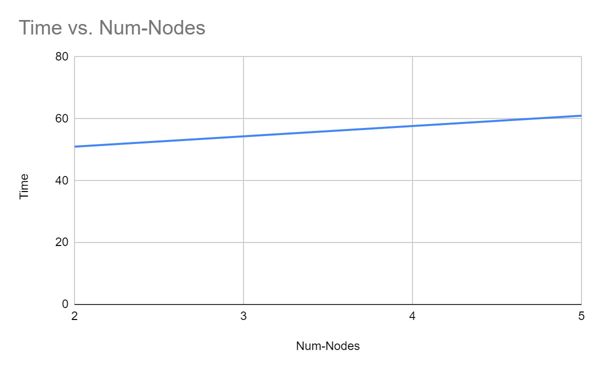


Para los clusters de propósito computacional:


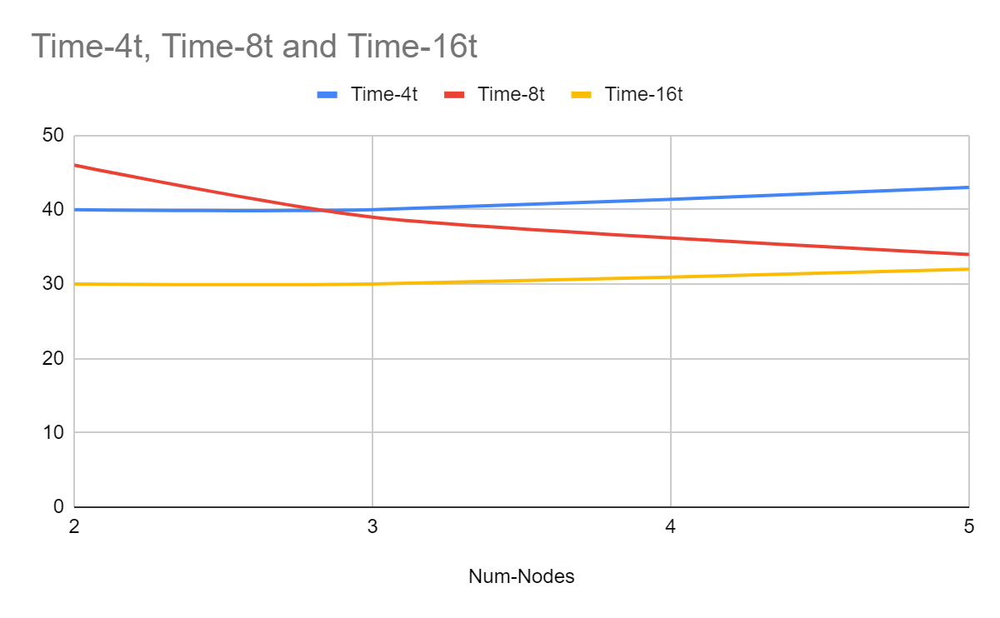


Se puede ver que aquí hay más que analizar, lo primero es que el mejor rendimiento lo da el cluster de 3 nodos y 16 Threads por procesador. Esto se ve claramente porque en las gráficas de rendimiento porcentual de la CPU es el cluster más bajo de todos. Se podría decir que para esta cantidad de datos y procesamiento, el punto óptimo entre mover los datos y procesarlos es el cluster con 3 nodos y 16 Threads por CPU.

El principal problema de la descentralización es a su vez la descentralización, es decir, que si separas mucho el procesamiento acabas perdiendo tiempo en el reparto y la concatenación de resultados como lo perderías en el procesamiento centralizado de ese mismo problema. Parece ser que para éste el mínimo es el cluster 10.

El tiempo de ejecución en mi PC es 4 minutos 36 segundos, he considerado absurdo valorarlo. 


### 6. Conclusión

Nuestra idea era ver como distintas causas afectan en mayor o en menor medida a los accidentes producidos, y por ello esperábamos algunos resultados como que por ejemplo los fines de semana hubiera accidentes más severos, o que en los tiempos de confinamiento de US no hubiera accidente o fueran mínimos, pero nos hemos encontrado con datos sorprendentes:

En cuanto a los meses y años, se puede observar con en las mayoría de años se obtienen resultados razonables (aunque nos dimos cuenta de que hasta 2020 no hubo accidentes clasificados con severidad 1).


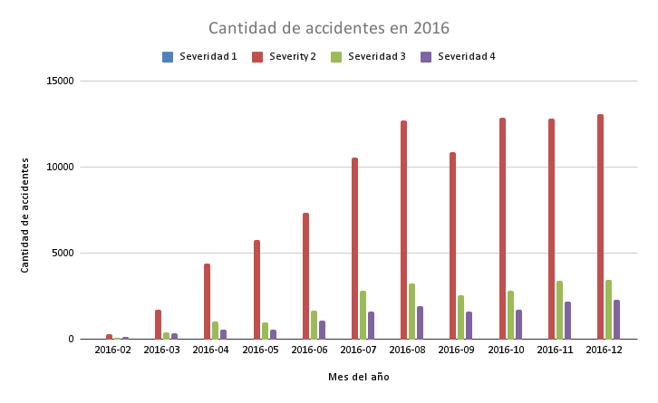


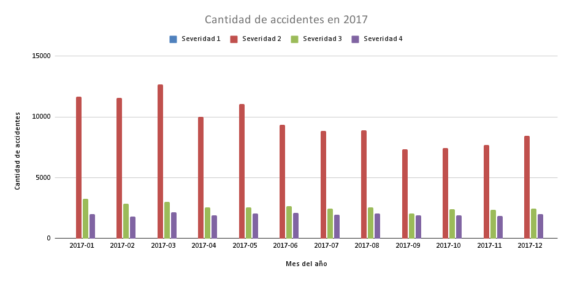


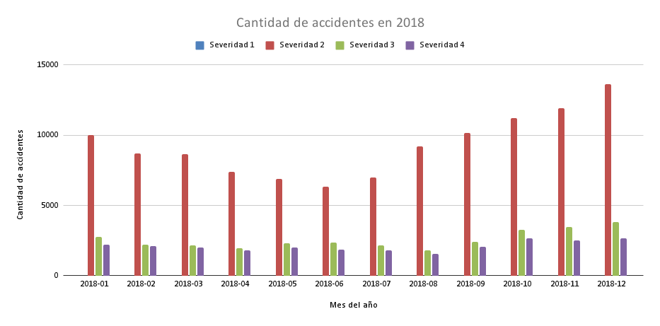


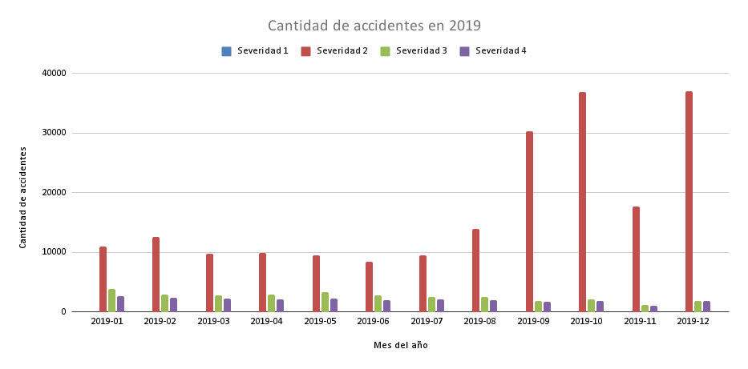


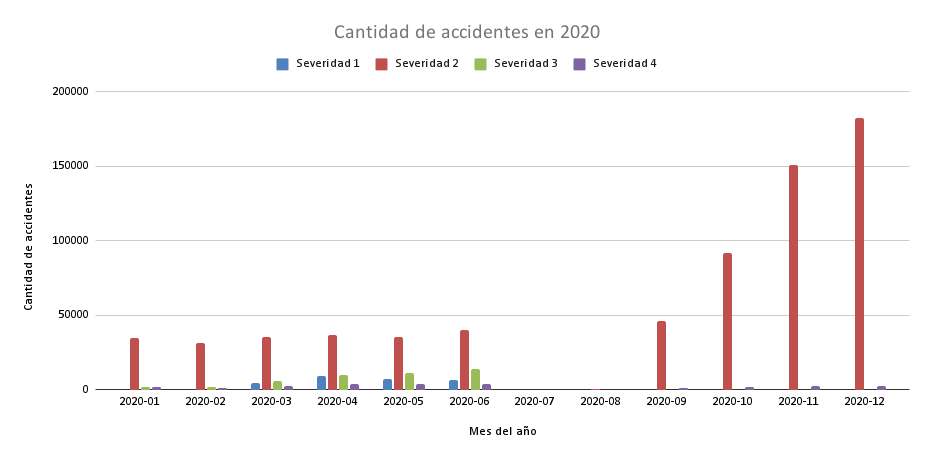


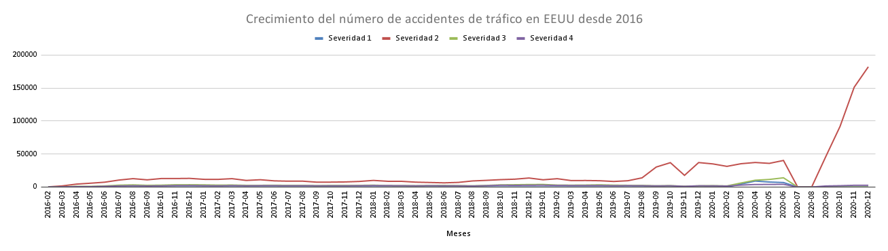


Como se puede ver en las gráficas, hasta 2020 no hay accidentes de severidad 1, y en 2020 hay un crecimiento sin sentido de los accidentes en septiembre.

También se puede observar que en los primeros meses no hubo tantos accidentes registrados como en los demás, y suponemos que es porque los medios para poder registrarlos se estaban instaurando.

En cuanto a la severidad, sin tener en cuenta 2020, y obviando la severidad 1, podemos concluir que la mayoría de accidentes eran de una gravedad baja y posiblemente producidos dentro de ciudad. Siendo, en número, mucho más significativos que los accidentes más graves.

Pasando a analizar los días de la semana en que sucedieron los accidentes también obtuvimos datos sorprendentes, ya que esperábamos muchos más accidentes los días del fin de semana, y con mayor gravedad pero solo acertamos en la gravedad, aunque fuera por muy pocas décimas, lo que nos resultó sorprendente.


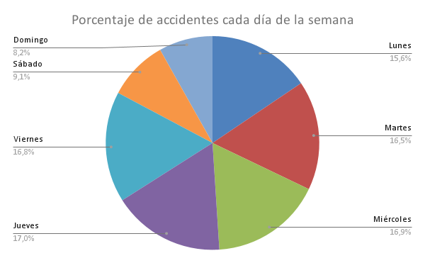


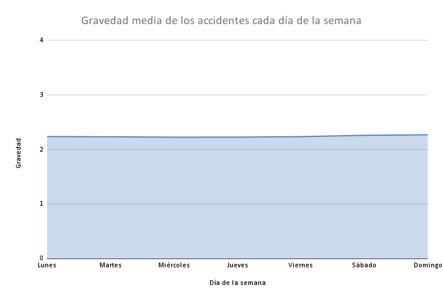


En cuanto a la las franjas horarias obtuvimos los siguientes datos:


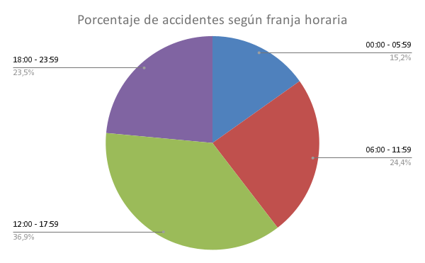


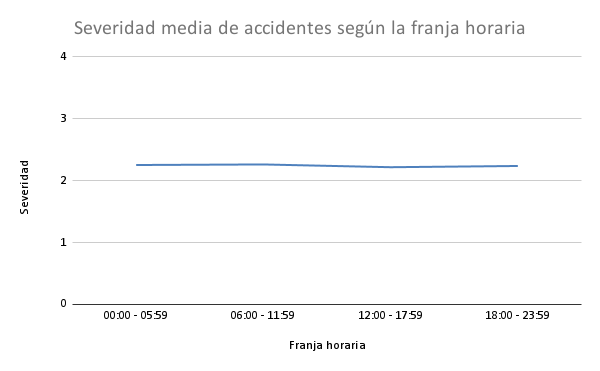


Obteniendo la mayor concentración de accidentes entre las 12:00 y las 16:60, y las 06:00 y 11:59, siendo el primer espacio horario en el que la gente entra y sale de trabajar y el segundo en el que entra.

y como era de esperar a altas horas de la noche menos accidentes pero más graves, aunque igual que en los fines de semanas la diferencia de gravedad es ínfima.

La siguiente gráfica a analizar es la de los estados, en la que se ve que hay estados con unas cifras desproporcionada. Lo que nos hace sospechar que los datos del dataset no han sido recogidos de manera uniforme en todos los Estados.


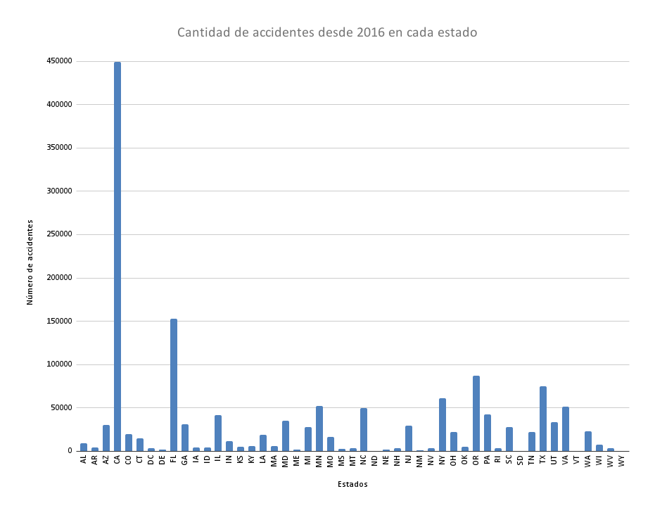


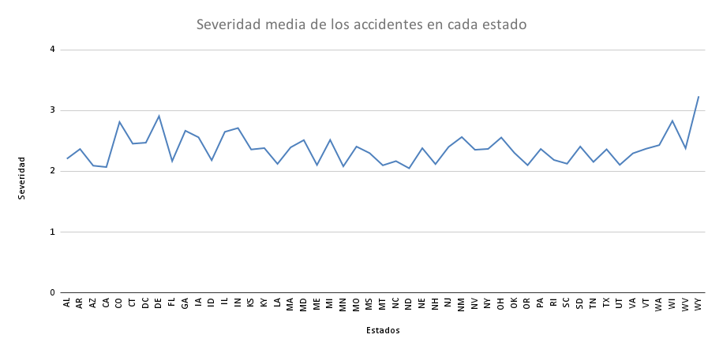


Y por último los datos que tienen que ver con el estado meteorológico. En el que se ve una mayor coherencia de los datos, ya que en condiciones meteorológicas desfavorables hay menos accidentes, ya que la gente es más reacia a salir, pero que justo en esos malos tiempos es donde hay mayor gravedad.


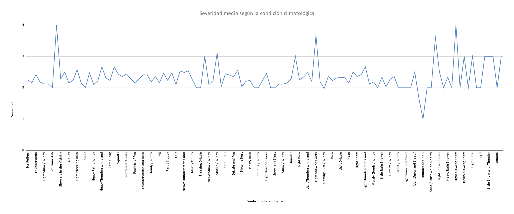
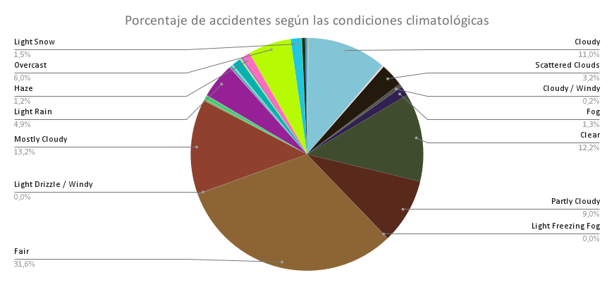


Viendo la procedencia de los datos nos dimos cuenta de que fueron extraídos por una API que accede a los datos públicos de los estados y va guardando los datos, es por eso que existe esa brecha en el número de accidentes y la falta de consistencia en ellos.
