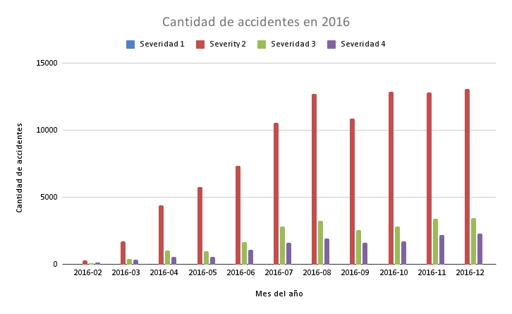
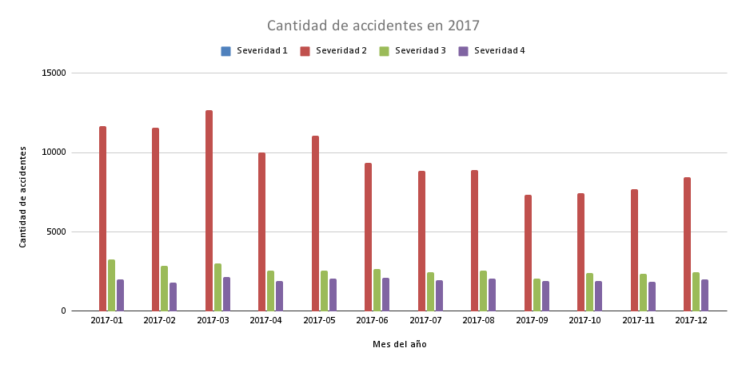
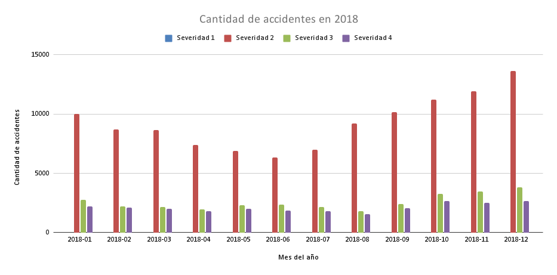
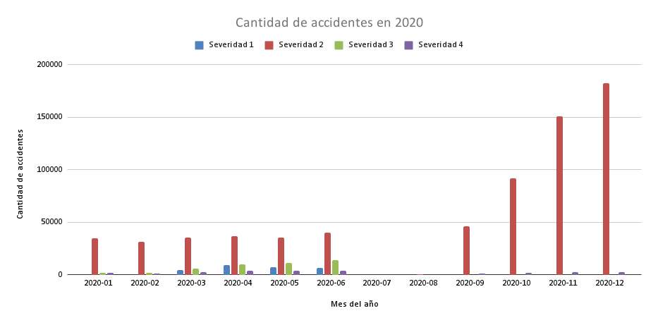
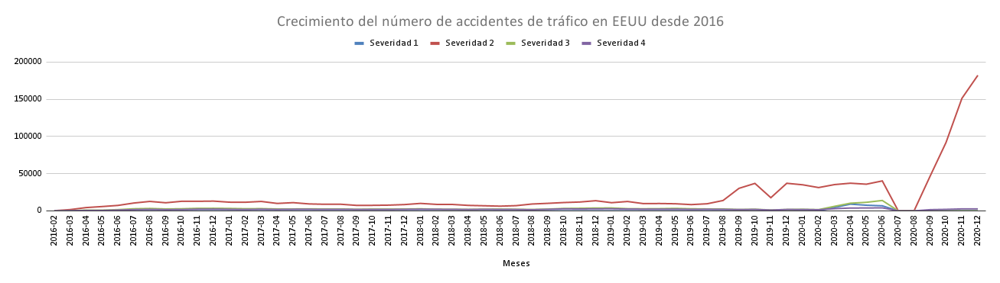
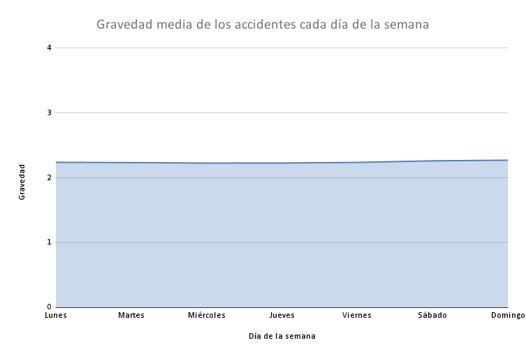
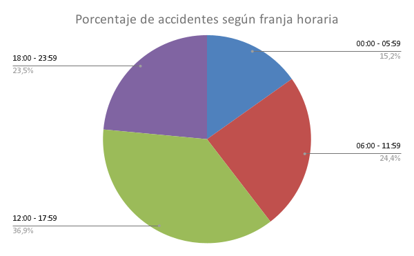
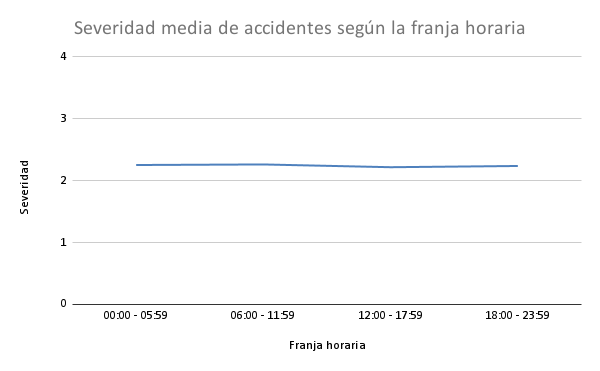
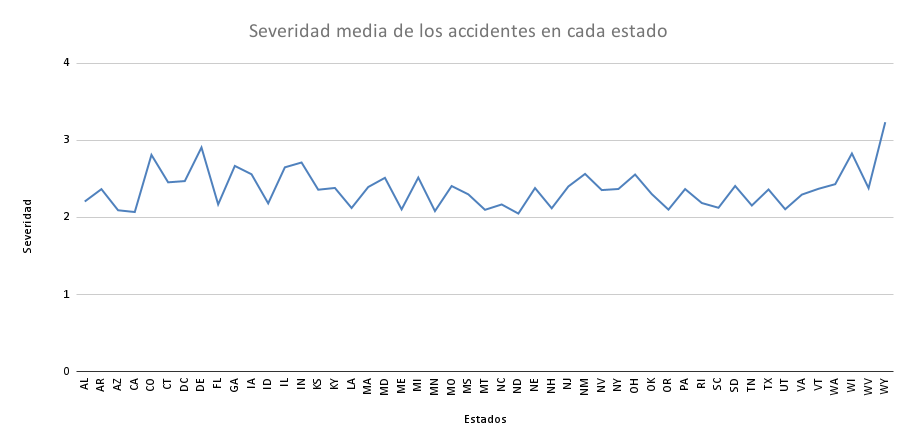
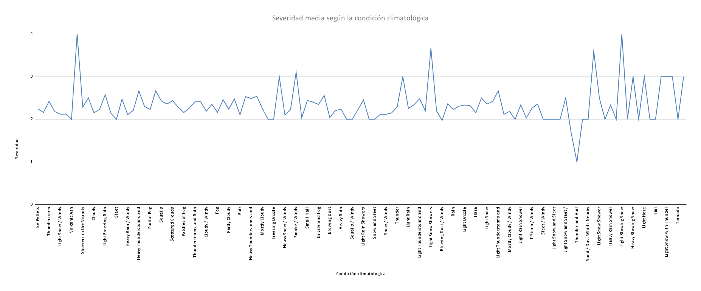

# Accidentes_de_trafico_EEUU

<!-----
NEW: Check the "Suppress top comment" option to remove this info from the output.

Conversion time: 3.129 seconds.


Using this Markdown file:

1. Paste this output into your source file.
2. See the notes and action items below regarding this conversion run.
3. Check the rendered output (headings, lists, code blocks, tables) for proper
   formatting and use a linkchecker before you publish this page.

Conversion notes:

* Docs to Markdown version 1.0β31
* Mon Dec 13 2021 09:28:04 GMT-0800 (PST)
* Source doc: Readme1
* This is a partial selection. Check to make sure intra-doc links work.
* Tables are currently converted to HTML tables.
* This document has images: check for >>>>>  gd2md-html alert:  inline image link in generated source and store images to your server. NOTE: Images in exported zip file from Google Docs may not appear in  the same order as they do in your doc. Please check the images!

----->


<p style="color: red; font-weight: bold">>>>>>  gd2md-html alert:  ERRORs: 0; WARNINGs: 0; ALERTS: 15.</p>
<ul style="color: red; font-weight: bold"><li>See top comment block for details on ERRORs and WARNINGs. <li>In the converted Markdown or HTML, search for inline alerts that start with >>>>>  gd2md-html alert:  for specific instances that need correction.</ul>

<p style="color: red; font-weight: bold">Links to alert messages:</p><a href="#gdcalert1">alert1</a>
<a href="#gdcalert2">alert2</a>
<a href="#gdcalert3">alert3</a>
<a href="#gdcalert4">alert4</a>
<a href="#gdcalert5">alert5</a>
<a href="#gdcalert6">alert6</a>
<a href="#gdcalert7">alert7</a>
<a href="#gdcalert8">alert8</a>
<a href="#gdcalert9">alert9</a>
<a href="#gdcalert10">alert10</a>
<a href="#gdcalert11">alert11</a>
<a href="#gdcalert12">alert12</a>
<a href="#gdcalert13">alert13</a>
<a href="#gdcalert14">alert14</a>
<a href="#gdcalert15">alert15</a>

<p style="color: red; font-weight: bold">>>>>> PLEASE check and correct alert issues and delete this message and the inline alerts.<hr></p>


1. El Proyecto
    * Descripción del problema
    * Necesidad de Big Data
    * Solución
2. Modelo de datos
3. Descripción técnica
    * Información sobre el dataset
    * Cómo ejecutar el programa
4. Rendimiento
5. Conclusión


### 1. El proyecto


#### 1.1 Descripción del problema

El objetivo es poder identificar las causas de los accidentes producidos en Estados Unidos para poder emprender medidas para reducirlos. Estudiaremos una gran cantidad de accidentes (1.516.064 accidentes) junto con el estado de muchas de las causas más frecuentes que los causan, como el día de la semana en el que se produjeron o la situación meteorológica.


#### 1.2 Necesidad de Big Data

Debido a la cantidad de accidentes, a todos los datos que trae cada uno (47 columnas) y a las costosas operaciones necesarias para extraer los datos(como ordenar todos los accidentes por un dato en concreto) es casi obligatorio utilizar las tecnologías  del Big Data para llegar a unos resultados razonables.


#### 1.3 Solución

Para poder hemos identificado una modelo de actuación sobre el dataset: 

Separando en scripts distintos por cada dato que queríamos obtener, hemos aislado las columnas necesarias para el análisis y mediante funciones proporcionadas por pyspark hemos procesado los datos haciendo tanto recuento de los accidentes como la media de la gravedad de estos.

Una vez obtenidos los datos, guardando la salida por csv hemos sido capaces de crear gráficos para ver los resultados de forma visual poder analizarlos y sacar una conclusión.

Ejemplo de tabla:


<p id="gdcalert1" ><span style="color: red; font-weight: bold">>>>>>  gd2md-html alert: inline image link here (to images/image1.png). Store image on your image server and adjust path/filename/extension if necessary. </span><br>(<a href="#">Back to top</a>)(<a href="#gdcalert2">Next alert</a>)<br><span style="color: red; font-weight: bold">>>>>> </span></p>





### 2. Modelo de datos 

               

<p id="gdcalert2" ><span style="color: red; font-weight: bold">>>>>>  gd2md-html alert: inline image link here (to images/image2.png). Store image on your image server and adjust path/filename/extension if necessary. </span><br>(<a href="#">Back to top</a>)(<a href="#gdcalert3">Next alert</a>)<br><span style="color: red; font-weight: bold">>>>>> </span></p>


Los datos han sido obtenidos de la web “kaggle”, concretamente de esta entrada:

[https://www.kaggle.com/sobhanmoosavi/us-accidents](https://www.kaggle.com/sobhanmoosavi/us-accidents)

Al descargar este csv se pueden observar miles de accidentes así como datos sobre ellos.

Las datos más relevantes para nuestro análisis han sido:


* Fecha de inicio del accidente. Tanto para saber el mes y el año como para saber el día de la semana en la que se produjo y la franja horaria.
* Estado (de Estados Unidos) en el que se produjo.
* Gravedad del accidente. Del 1 al 4. En la tabla se llama CSV.
* Estado meteorológico. 

	


### 3. Descripción técnica	


#### Información del dataset

Software usado:


* 1 archivo .csv con el dataset.
* 1 archivo de excel por cada conjunto de datos obtenido (6 en total).
* 6 scripts en python para el procesamiento del .csv inicial y encargados de generar los excel para poder crear las gráficas.
* 14 imágenes en png necesarias para facilitar el análisis de los datos. 

La mayoría del software ha sido creado en ubuntu y su ejecución la hemos realizado mediante el terminal de Ubuntu Bash con el soporte de Pyspark. Para que funcione correctamente el dataset inicial (US_Accidents_Dec20_updated.csv) debería localizarse en el mismo directorio . Para ejecutar el script hay que escribir "spark-submit (nombre del script)". Tras la ejecución se genera tanto el output por consola como un excel que se puede abrir y de dónde hemos sacado las gráficas.

 

Los 6 archivos que hemos creado sirven para obtener tanto el número de accidentes como la media de severidad según:


* Mes y año (desde 2016 hasta 2020).
* Estado.
* Día de la semana.
* Franja horaria.
* Clima
* Visibilidad


#### Cómo ejecutar el programa

	

Para ejecutar en **local** primero hay que tener instalado python.


```
$ sudo apt-get install python
```


Y ahora instalar pyspark. 


```
$ curl -O https://ftp.cixug.es/apache/spark/spark-3.1.2/spark-3.1.2-bin-hadoop3.2.tgz
$ tar xvf spark-3.1.2-bin-hadoop3.2.tgz
$ sudo mv spark-3.1.2-bin-hadoop3.2 /usr/local/spark
```


Y cada vez que se inicie una sesión para probar el software hay que actualizar la variable PATH mediante el siguiente comando:


```
$ source ~/.profile
```


Con los anteriores requisitos cumplidos, habiendo actualizado PATH sobre el directorio del proyecto, ya se pueden ejecutar los datos. Para ello hay que ejecutar el siguiente comando sustituyendo &lt;script> por el nombre del script


```
$ spark-submit <script>
```


Por ejemplo: $ spark-submit T1_Months.py

Obteniendo de cada script un mensaje por consola en el que se puede observar la tabla con el resultado, y un archivo .xlsx (excel).

Para ejecutar en el **cloud** ….


### 4. Rendimiento

Dentro de este apartado analizaremos el rendimiento de las dos caras de nuestro proyecto, tanto el data-processing con pyspark como el desarrollo del machine learning.


### 6. Conclusión

Nuestra idea era ver como distintas causas afectan en mayor o en menor medida a los accidentes producidos, y por ello esperábamos algunos resultados como que por ejemplo los fines de semana hubiera accidentes más severos, o que en los tiempos de confinamiento de US no hubiera accidente o fueran mínimos, pero nos hemos encontrado con datos sorprendentes:

En cuanto a los meses y años, se puede observar con en las mayoría de años se obtienen resultados razonables (aunque nos dimos cuenta de que hasta 2020 no hubo accidentes clasificados con severidad 1).


<p id="gdcalert3" ><span style="color: red; font-weight: bold">>>>>>  gd2md-html alert: inline image link here (to images/image3.png). Store image on your image server and adjust path/filename/extension if necessary. </span><br>(<a href="#">Back to top</a>)(<a href="#gdcalert4">Next alert</a>)<br><span style="color: red; font-weight: bold">>>>>> </span></p>


<p id="gdcalert4" ><span style="color: red; font-weight: bold">>>>>>  gd2md-html alert: inline image link here (to images/image4.png). Store image on your image server and adjust path/filename/extension if necessary. </span><br>(<a href="#">Back to top</a>)(<a href="#gdcalert5">Next alert</a>)<br><span style="color: red; font-weight: bold">>>>>> </span></p>





<p id="gdcalert5" ><span style="color: red; font-weight: bold">>>>>>  gd2md-html alert: inline image link here (to images/image5.png). Store image on your image server and adjust path/filename/extension if necessary. </span><br>(<a href="#">Back to top</a>)(<a href="#gdcalert6">Next alert</a>)<br><span style="color: red; font-weight: bold">>>>>> </span></p>





<p id="gdcalert6" ><span style="color: red; font-weight: bold">>>>>>  gd2md-html alert: inline image link here (to images/image6.png). Store image on your image server and adjust path/filename/extension if necessary. </span><br>(<a href="#">Back to top</a>)(<a href="#gdcalert7">Next alert</a>)<br><span style="color: red; font-weight: bold">>>>>> </span></p>


<p id="gdcalert7" ><span style="color: red; font-weight: bold">>>>>>  gd2md-html alert: inline image link here (to images/image7.png). Store image on your image server and adjust path/filename/extension if necessary. </span><br>(<a href="#">Back to top</a>)(<a href="#gdcalert8">Next alert</a>)<br><span style="color: red; font-weight: bold">>>>>> </span></p>





<p id="gdcalert8" ><span style="color: red; font-weight: bold">>>>>>  gd2md-html alert: inline image link here (to images/image8.png). Store image on your image server and adjust path/filename/extension if necessary. </span><br>(<a href="#">Back to top</a>)(<a href="#gdcalert9">Next alert</a>)<br><span style="color: red; font-weight: bold">>>>>> </span></p>





Como se puede ver en las gráficas, hasta 2020 no hay accidentes de severidad 1, y en 2020 hay un crecimiento sin sentido de los accidentes en septiembre.

También se puede observar que en los primeros meses no hubo tantos accidentes registrados como en los demás, y suponemos que es porque los medios para poder registrarlos se estaban instaurando.

En cuanto a la severidad, sin tener en cuenta 2020, y obviando la severidad 1, podemos concluir que la mayoría de accidentes eran de una gravedad baja y posiblemente producidos dentro de ciudad. Siendo, en número, mucho más significativos que los accidentes más graves.

Pasando a analizar los días de la semana en que sucedieron los accidentes también obtuvimos datos sorprendentes, ya que esperábamos muchos más accidentes los días del fin de semana, y con mayor gravedad pero solo acertamos en la gravedad, aunque fuera por muy pocas décimas, lo que nos resultó sorprendente.


<p id="gdcalert9" ><span style="color: red; font-weight: bold">>>>>>  gd2md-html alert: inline image link here (to images/image9.png). Store image on your image server and adjust path/filename/extension if necessary. </span><br>(<a href="#">Back to top</a>)(<a href="#gdcalert10">Next alert</a>)<br><span style="color: red; font-weight: bold">>>>>> </span></p>


<p id="gdcalert10" ><span style="color: red; font-weight: bold">>>>>>  gd2md-html alert: inline image link here (to images/image10.png). Store image on your image server and adjust path/filename/extension if necessary. </span><br>(<a href="#">Back to top</a>)(<a href="#gdcalert11">Next alert</a>)<br><span style="color: red; font-weight: bold">>>>>> </span></p>





En cuanto a la las franjas horarias obtuvimos los siguientes datos:


<p id="gdcalert11" ><span style="color: red; font-weight: bold">>>>>>  gd2md-html alert: inline image link here (to images/image11.png). Store image on your image server and adjust path/filename/extension if necessary. </span><br>(<a href="#">Back to top</a>)(<a href="#gdcalert12">Next alert</a>)<br><span style="color: red; font-weight: bold">>>>>> </span></p>





<p id="gdcalert12" ><span style="color: red; font-weight: bold">>>>>>  gd2md-html alert: inline image link here (to images/image12.png). Store image on your image server and adjust path/filename/extension if necessary. </span><br>(<a href="#">Back to top</a>)(<a href="#gdcalert13">Next alert</a>)<br><span style="color: red; font-weight: bold">>>>>> </span></p>





Obteniendo la mayor concentración de accidentes entre las 12:00 y las 16:60, y las 06:00 y 11:59, siendo el primer espacio horario en el que la gente entra y sale de trabajar y el segundo en el que entra.

y como era de esperar a altas horas de la noche menos accidentes pero más graves, aunque igual que en los fines de semanas la diferencia de gravedad es ínfima.

La siguiente gráfica a analizar es la de los estados, en la que se ve que hay estados con unas cifras desproporcionada. Lo que nos hace sospechar que los datos del dataset no han sido recogidos de manera uniforme en todos los Estados.


<p id="gdcalert13" ><span style="color: red; font-weight: bold">>>>>>  gd2md-html alert: inline image link here (to images/image13.png). Store image on your image server and adjust path/filename/extension if necessary. </span><br>(<a href="#">Back to top</a>)(<a href="#gdcalert14">Next alert</a>)<br><span style="color: red; font-weight: bold">>>>>> </span></p>


<p id="gdcalert14" ><span style="color: red; font-weight: bold">>>>>>  gd2md-html alert: inline image link here (to images/image14.png). Store image on your image server and adjust path/filename/extension if necessary. </span><br>(<a href="#">Back to top</a>)(<a href="#gdcalert15">Next alert</a>)<br><span style="color: red; font-weight: bold">>>>>> </span></p>





Y por último los datos que tienen que ver con el estado meteorológico. En el que se ve una mayor coherencia de los datos, ya que en condiciones meteorológicas desfavorables hay menos accidentes, ya que la gente es más reacia a salir, pero que justo en esos malos tiempos es donde hay mayor gravedad.


<p id="gdcalert15" ><span style="color: red; font-weight: bold">>>>>>  gd2md-html alert: inline image link here (to images/image15.png). Store image on your image server and adjust path/filename/extension if necessary. </span><br>(<a href="#">Back to top</a>)(<a href="#gdcalert16">Next alert</a>)<br><span style="color: red; font-weight: bold">>>>>> </span></p>





Viendo la procedencia de los datos nos dimos cuenta de que fueron extraídos por una API que accede a los datos públicos de los estados y va guardando los datos, es por eso que existe esa brecha en el número de accidentes y la falta de consistencia en ellos.
